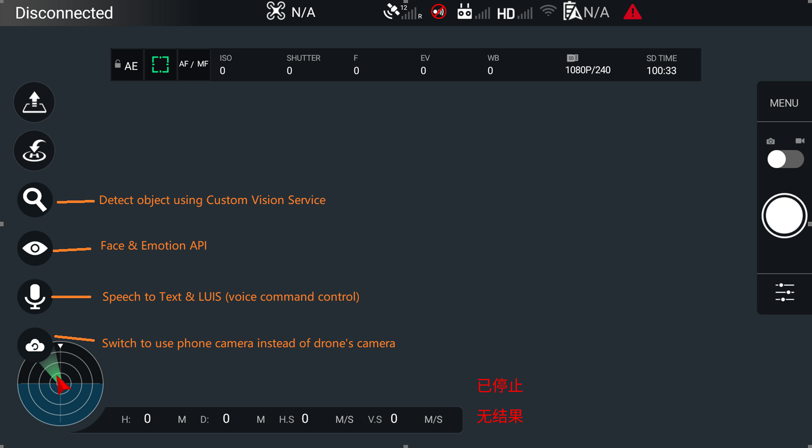
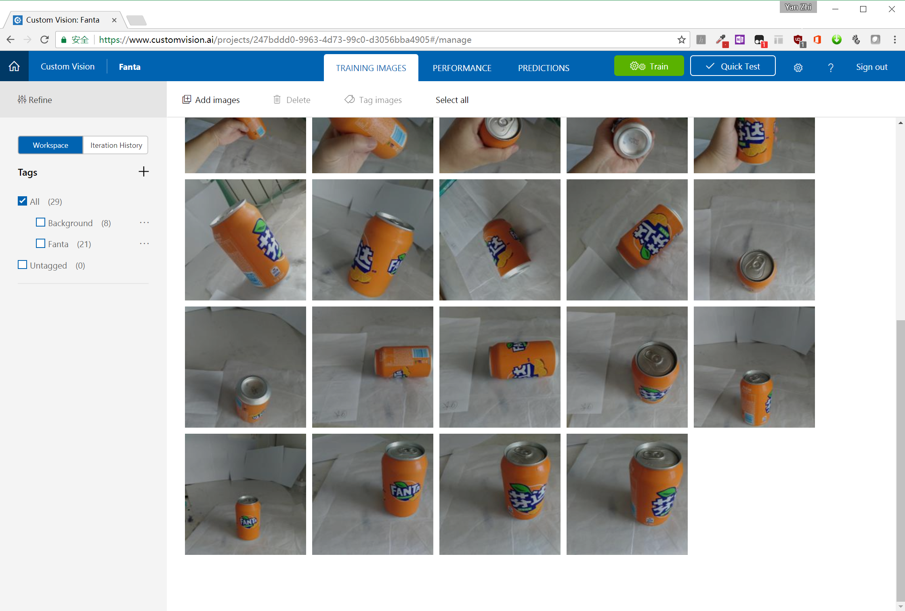

# DJI-CognitiveService

Demo of Using [Microsoft Cognitive Services](https://azure.microsoft.com/en-us/services/cognitive-services/) in DJI Drones，this project is based on [DJI UI Library](https://github.com/dji-sdk/Mobile-UILibrary-Android).

Features:

* Face & Emotion API
* Speech To Text
* LUIS (Language Understanding Intelligent Service)
* Custom Vision Service

To use this demo, you should apply to corresponding keys in Congitive Serivce of Azure Portal. For Custom Vision Service, you should upload photos to pre-train your model in 

